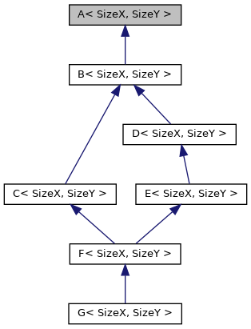

# Тест виртуального ромбовидного наследования  #

# Test virtual (diamond of death) inheritance #

Рис.1 - Структура ромбовидного наследования

Fig.1 - Diamond of death inheritance structure

<?\image html doc/structA__inherit__graph.png ?>
<?\image latex doc/structA__inherit__graph.png ?>

Тест виртуального (ромбовидного) наследования. Все классы иерархии содеражат матрицу armadillo и один int в качестве полей.
Все работает "из коробки", если у родительского класса A в явном виде прописать copy/move constructors по умолчанию (ключевое слово default).

Test virtual inheritance (diamond of death) with classes all contain one armadillo  matrix and integer fields.
Everything works "out of a box" if copy/move constructors are provided with "default" keyword in the parent class A.
